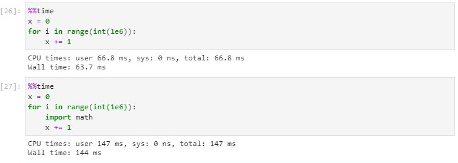

# Week5 Homework Feedback

**基本的诚信要求: 杜绝代码抄袭.**

好的代码: 正确、高效运行, 可读性好, 容易修改/debug.

## 具体的建议

### 避免在函数中使用全局变量

- 若一定要使用, 请显式声明 `global`, `nonlocal`.
- 在函数中混用全局变量和局部变量不是一个好的习惯. *你能时刻记住你修改的是全局变量吗?*


### 好的函数设计: 一个函数只实现一个功能

### 关于 `import` 语句

- 习惯上, `import` 语句放在代码最代码前面, 以提高可读性.
- 特别注意不要在函数、循环里 `import` 语句, 避免多次加载.



---

举个例子:

都用全局变量, 函数不传入参数. ❌

```python
import math

a, b, c, d, e = 1, 1, 1, 1, 180

s=(a+b+c+d)/2 #一部分运算放在了函数外

def l():
    # global a, b, c, d, e, s
    if a<b+c+d and b<c+d+a and c<a+c+d and d<a+b+c and a>0 and b>0 and c>0 and d>0:
        return math.sqrt((s-a)*(s-b)*(s-c)*(s-d)-a*b*c*d*(math.cos(e*math.pi/360))**2)
    else:
        return 0

print(l())
```

看起来都用了全局变量, 但是有一个变量不是. ❌

```python
import math

a, b, c, d, e = 1, 1, 1, 1, 180

s=(a+b+c+d)/2 #一部分运算放在了函数外
S=0

def l(S):
    #global a, b, c, d, s, e
    if a<b+c+d and b<c+d+a and c<a+c+d and d<a+b+c and a>0 and b>0 and c>0 and d>0:
        S=S+math.sqrt((s-a)*(s-b)*(s-c)*(s-d)-a*b*c*d*(math.cos(e*math.pi/360))**2) #这里的 S 是全局变量吗？ 并不是
        return S
    else:
        return 0

print(l(S))
```

更好的设计.

```python
import math

a, b, c, d, e = 1, 1, 1, 1, 180

def l(a, b, c, d, e):
    s=(a+b+c+d)/2
    if a<b+c+d and b<c+d+a and c<a+c+d and d<a+b+c and a>0 and b>0 and c>0 and d>0:
        S  = math.sqrt((s-a)*(s-b)*(s-c)*(s-d)-a*b*c*d*(math.cos(e*math.pi/360))**2)
        return S
    else:
        return 0

print(l(a, b, c, d, e))
```
