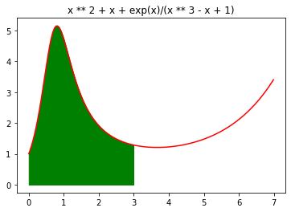

# Note

## Tips on the Midterm Exam

### Auto Completion & Built-in Help

Sometimes you may forget the exact name of a function. Then, auto completion can help you out. Use auto completion by typing `tab`. For example, you want to know how to sort a list via a built-in function.

```python
>>> list.
list.append(   list.clear(    list.copy(     list.count(    list.extend(   list.index(    list.insert(   list.mro(      list.pop(      list.remove(   list.reverse(  list.sort(
>>> help(list.sort)
```

The `help` command will give you a description of the function.

```
Help on method_descriptor:

sort(self, /, *, key=None, reverse=False)
    Sort the list in ascending order and return None.
    
    The sort is in-place (i.e. the list itself is modified) and stable (i.e. the
    order of two equal elements is maintained).
    
    If a key function is given, apply it once to each list item and sort them,
    ascending or descending, according to their function values.
    
    The reverse flag can be set to sort in descending order.
```

### Debugging

Debugging is an important part of programming. Make sure you've learned debugging in your excercises.

Two typical approaches:

1. Use `print` function to monitor variable values.
2. Use the debugger.

When the program is complicated, split it into several functions, and make sure each of them is working correctly.

### Openjudge Error Types

The errors you mostly meet:

- `Wrong Answer` means your program gives wrong answers to some test data.
- `Presentation Error` means your result is generally correct, but have some problems in blank characters.
- `Runtime Error` means your program runs into errors, e.g. `KeyError`, etc.
- `Compile Error` means your program is found to have errors *before getting executed*. For example, the program uses an undefined variable, or unmatched parentheses, etc.
- `Time Limit Exceeded` means your program's time cost exceed time limit. You should check whether your program runs into an endless loop, or whether you can speed it up.
- `Memory Limit Exceeded` means your program's memory cost exceed memory limit.

## An Short Review on the First Half Semester

### Input and Output

Input:

```
input(prompt=None, /)
    Read a string from standard input.  The trailing newline is stripped.
    
    The prompt string, if given, is printed to standard output without a
    trailing newline before reading input.
    
    If the user hits EOF (*nix: Ctrl-D, Windows: Ctrl-Z+Return), raise EOFError.
    On *nix systems, readline is used if available.
```

 The parameter `prompt` must be `None` when submitted to OJ.

Output: 

```
print(...)
    print(value, ..., sep=' ', end='\n', file=sys.stdout, flush=False)
    
    Prints the values to a stream, or to sys.stdout by default.
    Optional keyword arguments:
    file:  a file-like object (stream); defaults to the current sys.stdout.
    sep:   string inserted between values, default a space.
    end:   string appended after the last value, default a newline.
    flush: whether to forcibly flush the stream.
```

### String and List

String and list are similiar in many ways.

- Operations: `+`, `*`.
- Slicing. 
- Used in iterations.
- Other built-in functions: `cmp`, `count`, 'max', `index`, `sort` etc.

Conversion between string and list:

```python
>>> ''.join(['a', 'b', 'c'])
'abc'
>>> list('abc')
['a', 'b', 'c']
```

### Formated String

Use `str.format` to get formated strings. My suggestio is you should use it instead of the old-style with `%`. 

```python
>>> '{:.2f} {:06.2f}'.format(1.5, 1.5)
'1.50 001.50'
>>> '{:03d} {:05d}'.format(1, 2)
'001 00002'
```
More information: <pyformat.info>.

*Note: f-string is supported since 3.6. But not supported in OJ. :(*

### Copying a List (Not Required Now)

Copying a list is a little tricky. Let's start with an example. Say, we want a copy of `x`, and doing it by assignment.

```python
>>> x = [1]
>>> y = x
>>> x.append(2)
>>> x
[1, 2]
>>> y
[1, 2]
```

We find `x` and `y` are not changed indepedently. And in fact, they are referring to a same memory address. The correct way is using `copy`:

```python
>>> y = x.copy()
>>> x.append(2)
>>> x
[1, 2, 2]
>>> y
[1, 2]
```

The function `copy` is enough for most cases, but not for the case when you have lists inside a list.

```python
>>> x = [[]]
>>> y = x.copy()
>>> x[0].append(1)
>>> x
[[1]]
>>> y
[[1]]
```

In that case, we need `copy.deepcopy` to make the copy:

```python
>>> from copy import deepcopy
>>> x = [[]]
>>> y = deepcopy(x)
>>> x[0].append(1)
>>> x
[[1]]
>>> y
[[]]
```

Copying a list is not required in the first hald semester. **But if you really need to copy a list, do it with caution!** (Maybe you'd like to use `copy.deepcopy` in all cases to avoid troubles. Then, everything will be good except the time/memory cost of deep copying.)

*To better understanding the copying behaviors, you can check how list works in Python. The point is a list object contains memory address rather than values.*

### Recursion

## Excercise Selection

### Week8 Excercise - Meili Number

Using a brute-force method:

```python
def digits_sum(n):
	s = 0
	while n!=0:
		s += n%10
		n //= 10
	return s

def k_min_beau(k):
	i = 1
	n = 1
	while i<=k:
		if digits_sum(n)==10:
			i += 1
		n += 9
	n -= 9
	return n

k = int(input())
print(k_min_beau(k))
```

Note that we take the increment of `n` to avoid `TLE`.

Of course, there are better solutions.

### Week8 Homework - Monte Carlo



```python
import math
import random

def f(x):
	return (x**2 + x + math.exp(x)) / (x**3 - x + 1)

def monte_integ(x, num_samples):
	y_upper_lmt = 6.0
	integ = 0
	for _ in range(num_samples):
		u = x * random.random()
		y = y_upper_lmt  * random.random()
		if y<f(u):
			integ += 1
	integ *= x*y_upper_lmt/num_samples
	return integ

num_inputs = int(input())
inputs = [ float(input()) for _ in range(num_inputs) ]

num_samples = 1000000

for x in inputs:
	print('{:.1f}'.format(monte_integ(x, num_samples)))
```
