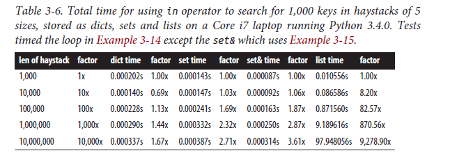

# Note

## More about Dictionaries

### Performance Test: Dictionaries, sets and lists

*Reference: Fluent Python (1st Edition), page 85.*

在 Python 中进行查找操作, 字典和集合地速度要比列表快很多. 考虑一个简单的性能测试:

> I generated an array of 10 million distinct double-precision floats, the
“haystack”. I then generated an array of needles: 1,000 floats, with 500 picked from the
haystack and 500 verified not to be in it.

分别在列表、字典和集合中进行查找:

```python
found = 0
for n in needles:
    if n in haystack:
        found += 1

# Or for set:
found = len(needles & haystack)
```

作者得到了如下性能结果:



可以看到列表的耗时随规模是线性的, 而字典和集合都是对数的. 这背后的机制是哈希查找, 感兴趣的同学可以阅读 *Fluent Python* 的 85-93 页, 或者参考其他的资料.

### Extracting a Subset of a Dictionary

*Reference: Python Cookbook 3rd Edition, Section 1.17.*

问题: 如何从字典中取其一部分? **字典解析**可以帮助我们轻松地做到这件事.

```python
prices = {
'ACME': 45.23,
'AAPL': 612.78,
'IBM': 205.55,
'HPQ': 37.20,
'FB': 10.75
}
# Make a dictionary of all prices over 200
p1 = { key:value for key, value in prices.items() if value > 200 }
# Make a dictionary of tech stocks
tech_names = { 'AAPL', 'IBM', 'HPQ', 'MSFT' }
p2 = { key:value for key,value in prices.items() if key in tech_names }
```

### Calculating with Dictionaries

*Reference: Python Cookbook 3rd Edition, Section 1.8.*

问题: 如何对字典中的键值对进行一些计算, 例如找最大值、找最小值、排序?

例如我们有一个字典, 储存了几只股票对应的股价. 我们像找到哪只股票价格最高或最低, 并且依照股价进行排序.

```python
prices = {
'ACME': 45.23,
'AAPL': 612.78,
'IBM': 205.55,
'HPQ': 37.20,
'FB': 10.75
}
```

利用 `zip` 函数可以"逆转"键值对, 这对于针对值的计算是很有用的, 也有比较好的性能. *注意: `zip` 返回的是迭代器, 是个一次性的东西.*
通过这种方式, 我们可以找到股价的最大值和最小值.

```python
min_price = min(zip(prices.values(), prices.keys()))
# min_price is (10.75, 'FB')
max_price = max(zip(prices.values(), prices.keys()))
# max_price is (612.78, 'AAPL')
```

我们同样也可以进行排序操作.

```python
prices_sorted = sorted(zip(prices.values(), prices.keys()))
# prices_sorted is [(10.75, 'FB'), (37.2, 'HPQ'),
# (45.23, 'ACME'), (205.55, 'IBM'),
# (612.78, 'AAPL')]
```

## Generators and Generator Functions

为什么要有生成器？

> 通过列表生成式，我们可以直接创建一个列表。但是，受到内存限制，列表容量肯定是有限的。
> 而且，创建一个包含 100 万个元素的列表，不仅占用很大的存储空间，如果我们仅仅需要访问前面几个元素，那后面绝大多数元素占用的空间都白白浪费了。 
> 所以，如果列表元素可以按照某种算法推算出来，那我们是否可以在循环的过程中不断推算出后续的元素呢？
> 这样就不必创建完整的 list，从而节省大量的空间。在 Python 中，这种一边循环一边计算的机制，称为生成器：generator。 (廖雪峰 Python 教程-生成器)

生成器的特点: 开销小, 只能顺序访问生成器的元素, 一次性.

### Generator Functions

例子: Creating New Iteration Patterns with Generators, from *Python Cookbook 3rd Edition, Section 4.3.*
我们想搞一个类似于 `range` 的迭代器, 但是支持浮点数的参数.

```python
def frange(start, stop, increment):
    x = start
    while x < stop:
        yield x
        x += increment
```

`range` 返回的迭代器可以做的事情, 这个自定义的生成器也可以完成:

```python
>>> frange(0, 4, 0.4)
<generator object frange at 0x7ff30e17d120>
>>> list(frange(0, 4, 0.4))
[0, 0.4, 0.8, 1.2000000000000002, 1.6, 2.0, 2.4, 2.8, 3.1999999999999997, 3.5999999999999996, 3.9999999999999996]
>>> sum(frange(0, 4, 0.4))
22.0
>>> sorted(frange(0, 4, 0.4))
[0, 0.4, 0.8, 1.2000000000000002, 1.6, 2.0, 2.4, 2.8, 3.1999999999999997, 3.5999999999999996, 3.9999999999999996]
```

### Generator Expressions

和列表解析的语法很相似.

```python
g = (i for i in range(100))
type(g)
# generator
```

## Solutions to Exercises

See solutions in directory `solutions`.

### Week 11-1: 计算矩阵边缘元素之和

判断边缘.

### Week 11-2: 图像模糊处理

要点: 用 `round` 来做四舍五入.

### Week 11-5: 螺旋加密

困难在于判断何时转向. 一种方法是假设不转向, 看会不会越界, 或者遇到已经填好的位置.

### 选做作业: 行列式 *

两种供参考的思路:

1. 利用子行列式的展开, 设计递归算法.
2. 实际中使用的方法: 用高斯消元法化成上三角矩阵. 复杂度 `O(n^3)`.